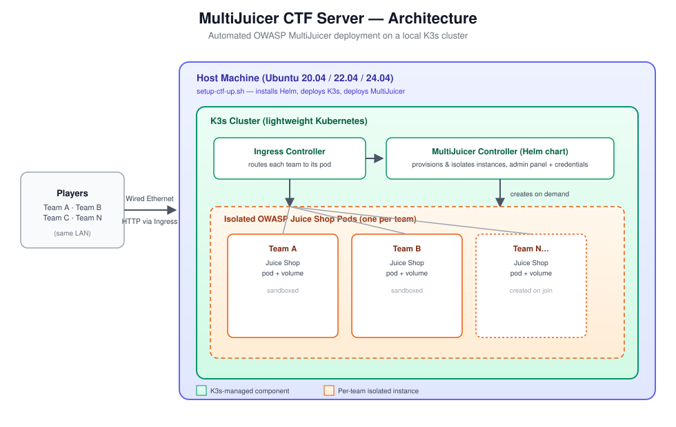

# MultiJuicer-Security-Constest-Server

[Leia em Português](README-pt.md)

Automated deployment of OWASP MultiJuicer on a local K3s cluster for hosting cybersecurity CTF events.

The objective of this repository is to provide a simple, automated, and ready-to-go environment for hosting local cybersecurity Capture The Flag (CTF) competitions. Through a single script, you can deploy the complete infrastructure required to support multiple teams (OWASP Juice Shop instances).

## Architecture Overview

To sustain the event, this project integrates two fundamental technologies:

*   [**OWASP Juice Shop**](https://owasp.org/projects/juice-shop): A modern and sophisticated insecure web application. It is intentionally developed with numerous security flaws (such as SQL Injection, XSS, and broken authentication) to be used for cybersecurity training and competitions.
*   [**MultiJuicer**](https://pwning.owasp-juice.shop/companion-guide/latest/part4/multi-juicer.html): In a standard CTF, if all participants attack a single Juice Shop instance, one player's actions could crash the server and ruin the contest for everyone else. MultiJuicer solves this by managing traffic and dynamically creating isolated Juice Shop instances within a Kubernetes cluster. Each team or player is assigned an exclusive, sandboxed environment.
*   [**K3s**](https://k3s.io): A highly available and extremely lightweight Kubernetes distribution. Instead of relying on resource-heavy virtual machines or complex cloud setups, K3s runs directly on the host machine with minimal overhead. This ensures that maximum CPU and RAM are preserved for the actual CTF container instances, making it the perfect orchestration engine for local labs and bare-metal environments.

<p align="center">
    
</p>

## Prerequisites and Critical Guidelines

Before initiating the deployment, please strictly adhere to the following infrastructure rules:

1. **Operating System:** This environment is designed exclusively for Linux systems (Ubuntu 20.04, 22.04, or 24.04 is highly recommended).
2. **Wired Connection Required:** The machine acting as the host server must be connected to the internet via an Ethernet cable. 
    * *Network Isolation Note:* If you host the server on a Wi-Fi connection, default router security rules (such as LAN/AP/Client Isolation) may restrict the network. In that scenario, only devices connected to the exact same Wi-Fi network will be able to see and access the contest.
3. **Resource Management:** Running multiple containers simultaneously requires significant system resources (CPU and RAM). Once the server is running, close all web browsers and background applications, leaving only the terminal open. This ensures the machine has maximum resources available to maintain stability during the event.

## Deployment Instructions

The deployment script will not run without proper system permissions. To start the environment, open your terminal in the project directory and follow these two steps:

**1. Grant execution permissions (Required):**
```bash
chmod +x setup-ctf-up.sh
```

**2. Execute the setup script:**
```bash
./setup-ctf-up.sh
```

The script will automatically handle the installation of Helm, the orchestration of the Kubernetes cluster (K3s), the MultiJuicer deployment, Ingress routing configurations, and the extraction of administrator credentials. Upon completion, the terminal will display the access IP for the participants and the admin panel password.

## Troubleshooting
If the script fails or the environment does not deploy correctly due to local system conflicts, you can debug the process manually.

The script is structured sequentially. In case of errors:

1. Open the setup-ctf-up.sh file in a text editor (such as Nano or VS Code).
2. Copy the commands and execute them one by one directly in your terminal.
3. This manual execution will allow you to pinpoint the exact stage (network, Kubernetes, or Helm) that is failing and analyze the specific error logs.
